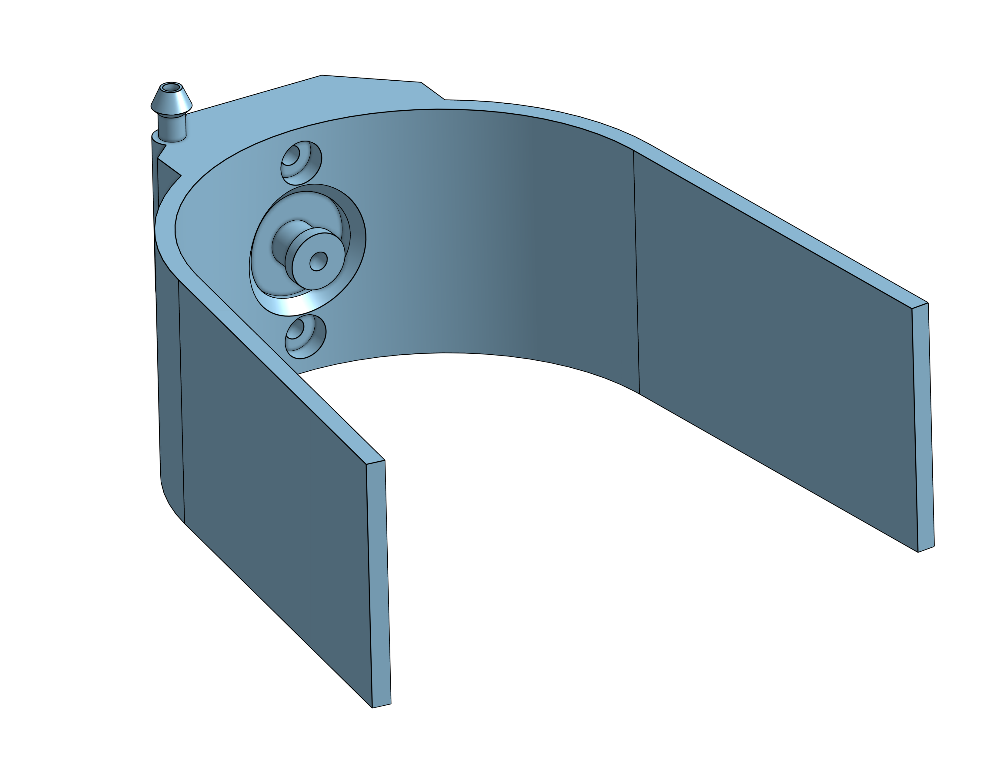

# Entonoir a ventouse

Le gorge a ventouse est un concept que j'ai dévelopée après le probléme de le pivotement de la boite de conserve avec le point de la planche au dessus d'elle.
l'idée est de soutenir la cannette mécaniquement tout en ayant un point d'aspiration.

## V1

voici la premiere idée.

Une ventouse se met au fond de la construction. le but étant que 4 de ces modéles sont sur le robot pour chaqu'un prendre une cannette, la longeur permet de soutenir égalment la planche pendant le mouvement