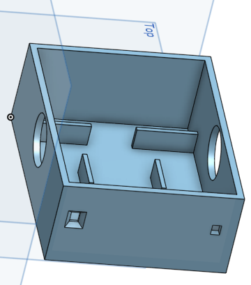
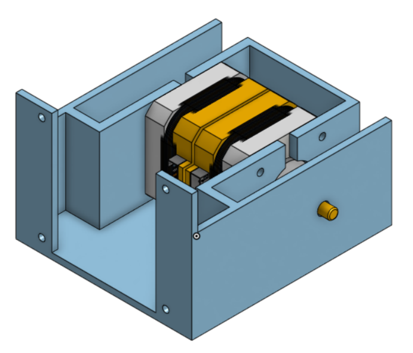

# Base roulante

La base roulante sera composée de 2 moteur pas à pas (Nema 17) qui permettent au PAMI de se déplacer ainsi que 2 capteurs laser qui, eux, sont utiles dans la détection de mouvement devant le robot.

## Les différents prototypes

Prototype n°1 

Surface (en mm) : 140x110x40

Prototype n°2

Surface (en mm) : 100x80x40
Ce prototype intègre des fonctionnalités supplémentaires comme l'emplacement des capteurs laser mais également l'emplacement de la futur carte éléctronique et les moteurs pas à pas.