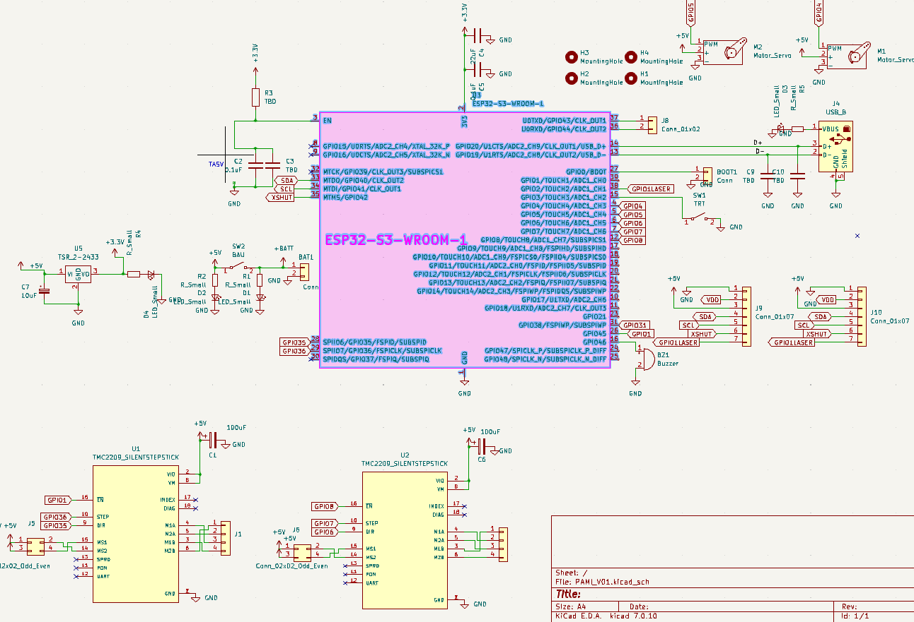
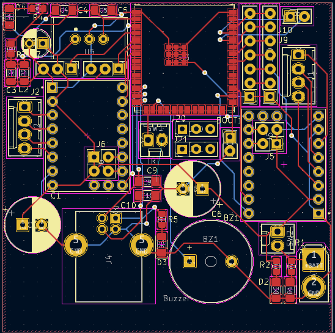
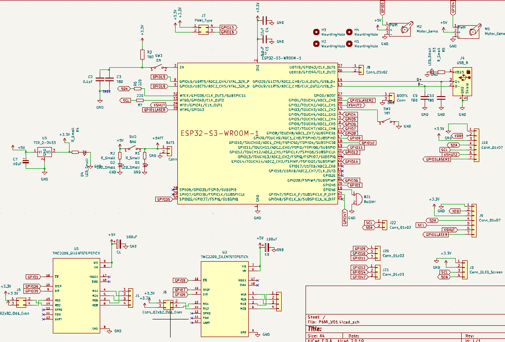
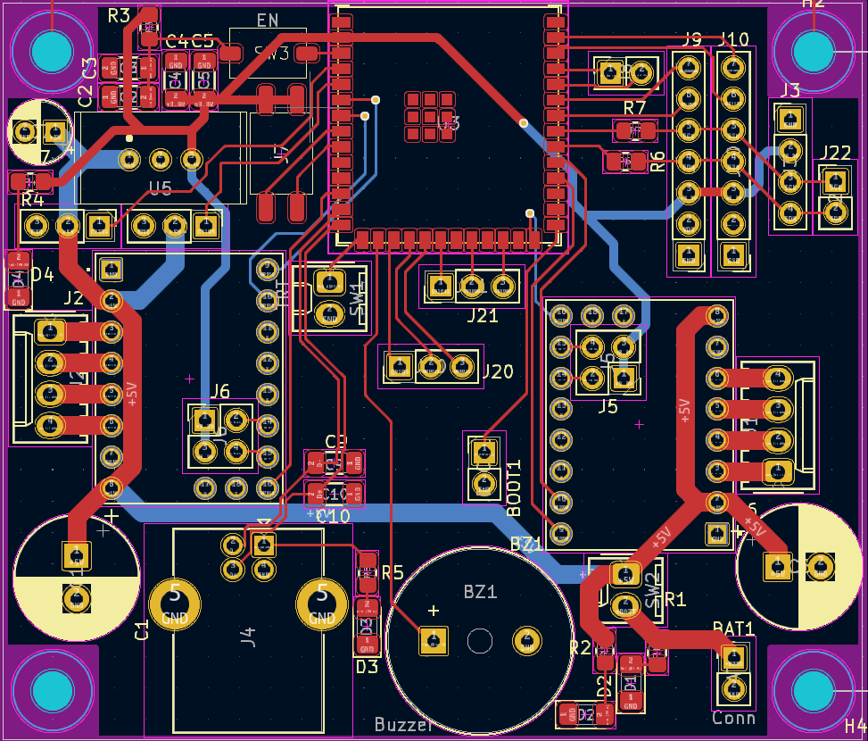

# Réfléxion 

Dans le but pouvoir se conformer au règlement et à notre stratégie nous avons pour objectif de construire un robot compact et plus petit que son homologue passé. Et c'est dans ce but que notre équipe a décidé de créér une carte électronique plus compact et intégrant de nouvelles fonctionnalités et de nouvelles utilisations avec potentiellement une adaptative à un robot de grande taille via l'ajout de module supplémentaire
# Carte Electronique

## Exemples de composants intégrés 

- 2*TMC2209 (driver moteur pas à pas)
- Connectique batterie
- 2*Connectique Servo
- Bouton d'arrêt d'urgence (BAU)
- Tirette (pour le démarrage du robot)
- Connectique 3 broches pour ajout de composants supplémentaires
- Switch pour le choix du type de PAMI et instauration d'un code Universel pour tout les robots au lieu de 4 codes afin de simplifier le travail des développeurs de l'équipe

## Prototypes de cartes

### Première version

#### Schéma de cablage

#### Carte électronique

\
Dimension : 60*55 mm

### Deuxième version

#### Schéma de cablage

#### Carte électronique

\
Dimension : 60*70 mm