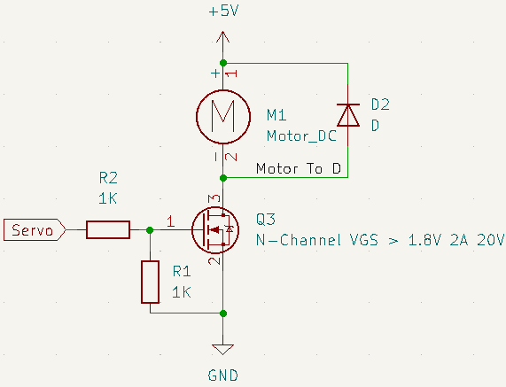
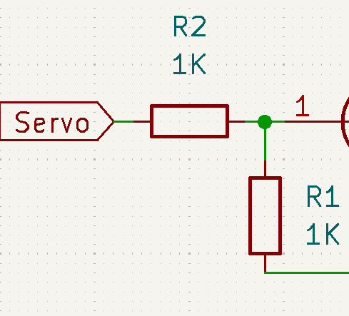
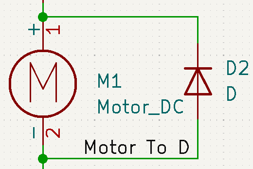
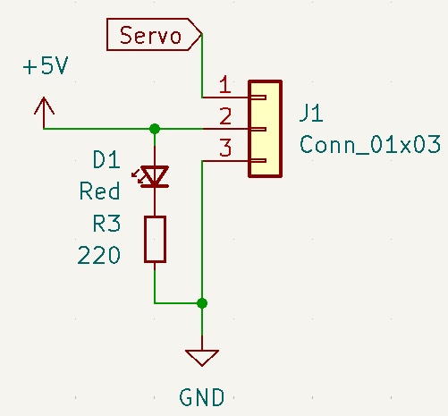
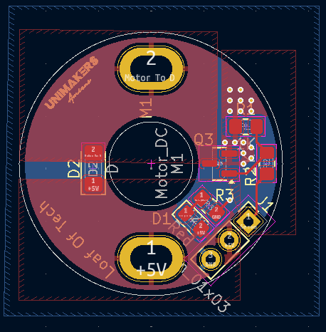
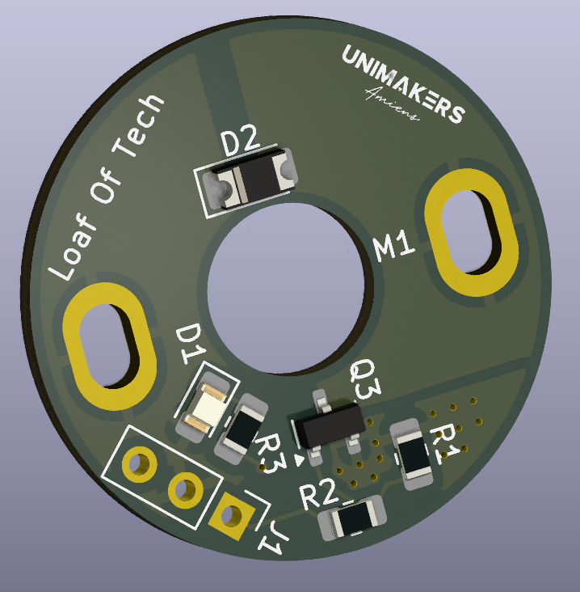

# Les pompes à vide

Pour alimenter le système pneumatique dans les actionneurs, il nous faut des pompes à vide. Celles que le club possédait étaient des petits moteurs DC avec un élément pompe vissé dessus.

Seulement un souci, les moteurs n'étaient pas de même tension nominale de fonctionnement, certains 12V, d'autres 5V, puis 3,7V, et d'autres même des tensions de 6,4V.

Non seulement ce sont des tensions hors de la tension logique d'un microcontrôleur, mais le microcontrôleur n'est pas capable de fournir un tel courant d'appel ni de fonctionnement qu'un moteur demande. C'est pourquoi un système, ou circuit de commande, doit être mis en place.

## La réflexion

Alors que notre carte électronique mère possède des connecteurs d'alimentation de différentes plages de tension, le souci est le nombre de pins de commande disponibles depuis l'ESP32. Il se trouve que la carte mère possède une extension de GPIO conçue pour des afficheurs ou la commande de servomoteurs. C'est ce dernier point qui nous intéresse. Si un servomoteur peut être contrôlé par un microprocesseur, nous pouvons également contrôler un moteur classique, non?

Le standard servomoteur est de 3 fils : masse, alimentation, signal.

Ok, nous avons l'idée de comment nous pourrions faire fonctionner le moteur, il nous faut un circuit de signal de commande à présent.

Après des recherches très rapides, j'ai schématisé le circuit que je voulais.

Décomposons ce circuit :

### Le pont diviseur

Les deux résistances connectées au microcontrôleur servent à deux choses : à réduire le courant de commande utilisé pour le MOSFET (R2), et à tirer la tension vers le rail de masse (R1). Cela permet en cas de déconnexion du signal de ne pas avoir un pin flottant et de quand même s'assurer de l'ouverture du circuit.

Les deux résistances forment également un pont diviseur de tension. Les deux résistances étant de même valeur, nous supposons que 3,3/2 = 1,75V est la tension reçue entre le gate et la source du MOSFET. Ce n'est pas la valeur de fonctionnement saturée du MOSFET, elle se trouve à 1,8V. On peut négliger l'écart, le MOSFET ne se fermera pas entièrement, mais si jamais le moteur est contrôlé par un microcontrôleur qui est nativement 5V, la tension de GS sera 2,5V, ce qui passe au-dessus du seuil d'ouverture maximale. Donc la carte est adaptée à des différentes logiques.

### Moteur diode

Pourquoi la diode ? Eh bien, quand un moteur s'éteint, il génère de l'électricité par lui-même, ce qui peut être dangereux pour le système. La diode faisant face au courant initial est là pour contenir la tension de décharge des bobines du moteur, protégeant ainsi les circuits connectés.

### Connecteur

Le connecteur est simple, il accueille les 3 fils pour redistribuer le courant sur la carte, il n'y a pas plus simple.

Une LED de témoin optionnelle est présente pour s'assurer de la présence de tension.

## Routage

Le routage de la carte est fait de façon que le plus de cuivre soit dédié au circuit moteur, le reste ce ne sont que des circuits de commande, donc ils peuvent rester petits.

