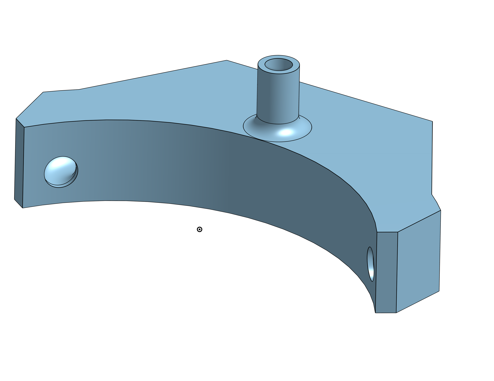
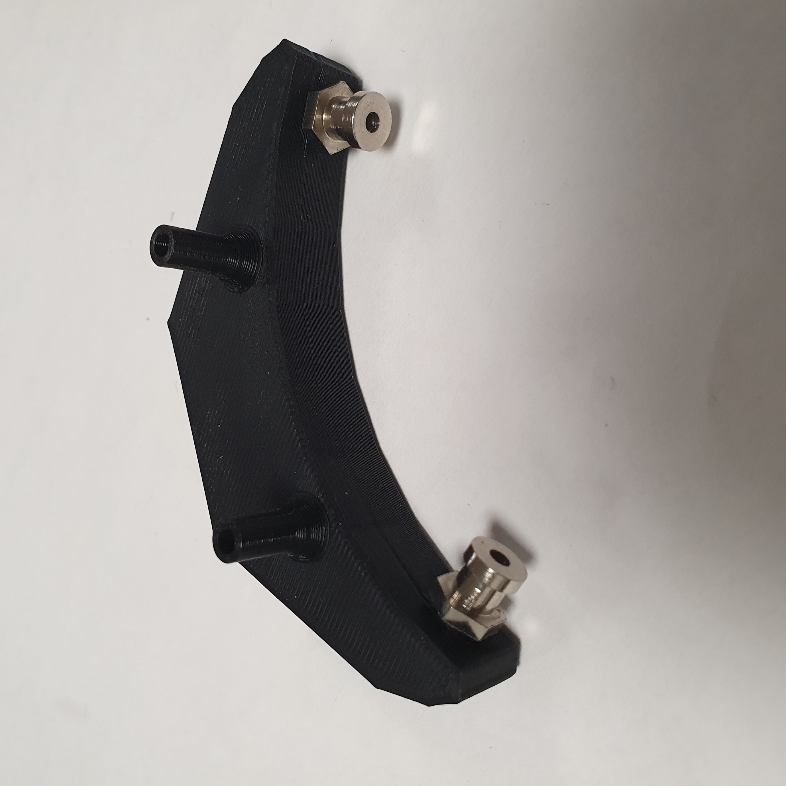
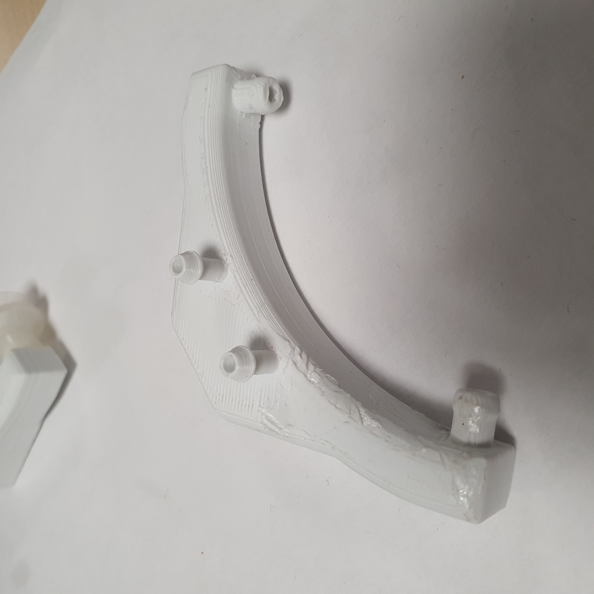
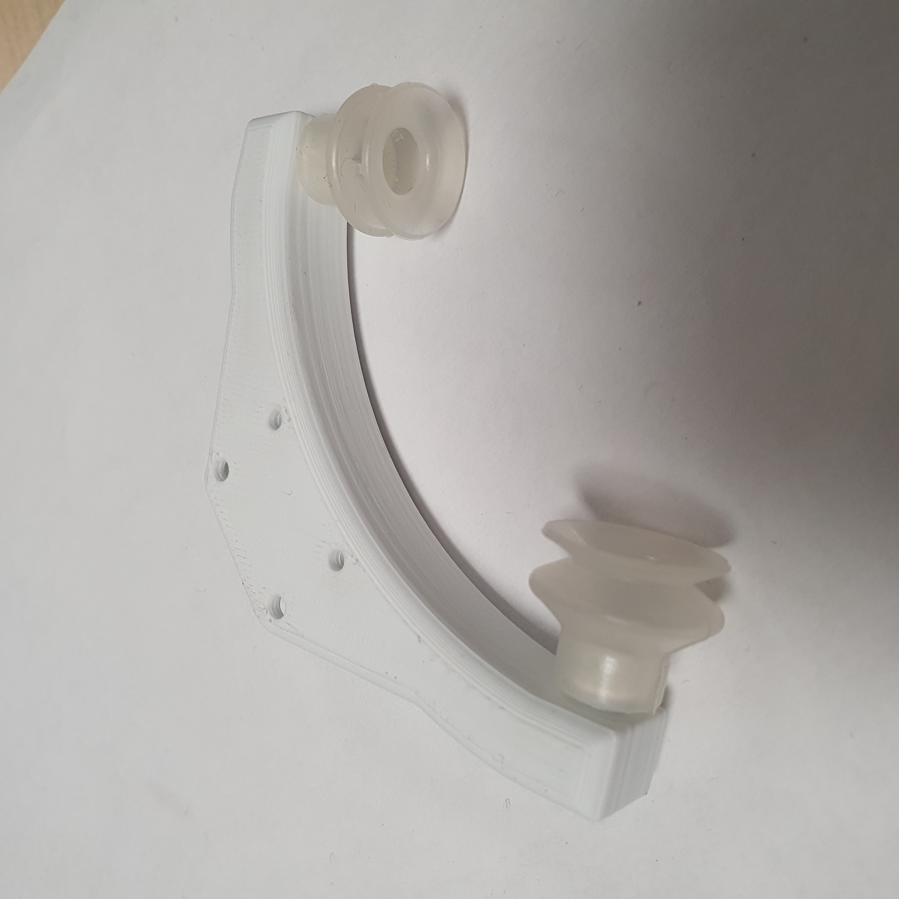
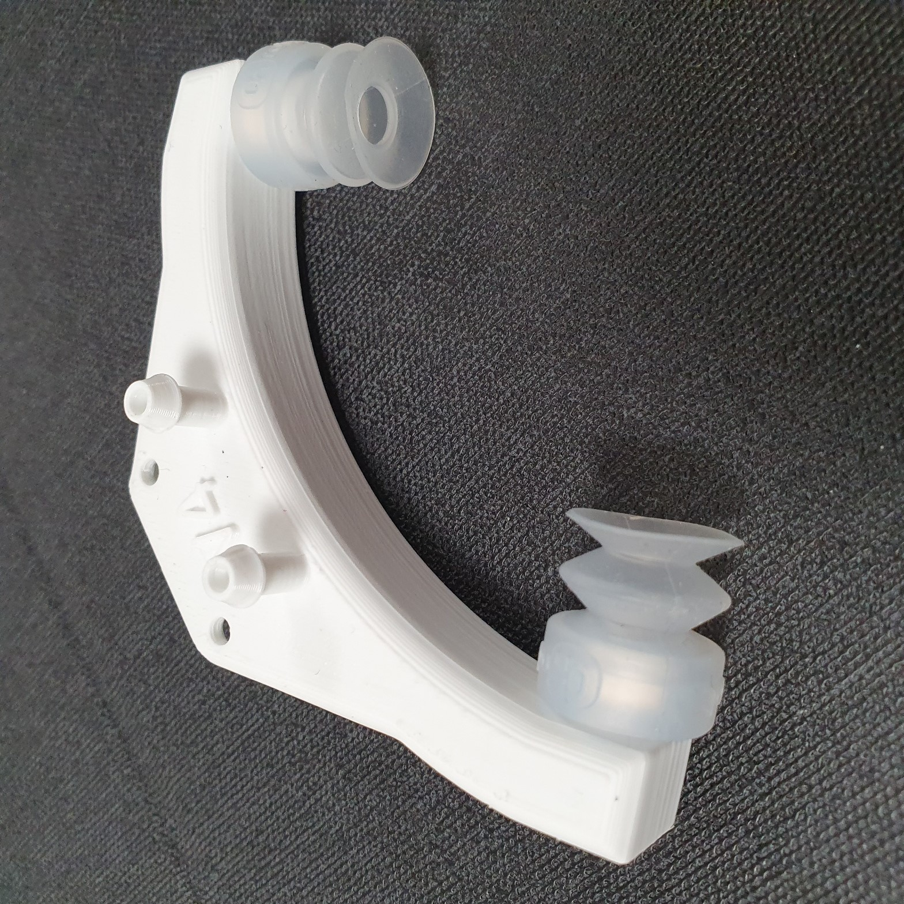

# le systéme a ventouses

## Description
On appelle une ventouse une calotte de caoutchouc qui peut être maintenue par la pression de l'air sur une surface plane. [source]https://www.larousse.fr/dictionnaires/francais/ventouse/81431

Le systéme qu'on crée est simple, la pompe a vide est reliée a une ventouse et en paralele une valve de remise a l'atmosphere.

la pompe tourne quand on attrape et on garde un élément sur le robot
la pompe s'éteint et la valve s'ouvre quandon veut lacher un élément

## V1

l'idée est d'avoir une stabilité de la boite de conserve pour pouvoir la déplacer sans que sa postion sur X Y relative au robot soit modifiée lors du déplacement, c'est pourquoi l'idée d'avoir 2 point d'appui pour bloquer
le mouvement est venue. 
Voici le résultat

Cette version avait 2 failles:
* Les 2 ventouses doivent etre absolument en contact avec la boite de conserver avant de pouvoir créer une dépression
* Le rayon de courbure ne prenais pas en compte la taille des ventouses

Neanmoins elle nous a permis de voir que le systéme de ventouses est assez puissant pour souslever les boites de conserve

## V2

Cette version à la bonne forme et a 2 canneaux d'air pour resoudre le probléme de 

## V3

Cette version a directement les adaptateurs ventouse intégrée dans l'impression, ça permet de reduire des fuites possible qu'impose une connexion filté 

Cette version a été testé sur le robot, et un soucis est en sorti, les ventouses etaient trop rigide, et avec un mouvement rectligne les Conservent ne s'asspirent pas et sont plutôt poussée vers l'avant

## V4

On a modifiée le desing pour adapter des ventous de ON Robot sur le préhenseur.
les ventouses sont plus souple, et prennent plus rapidement la boite de conservation